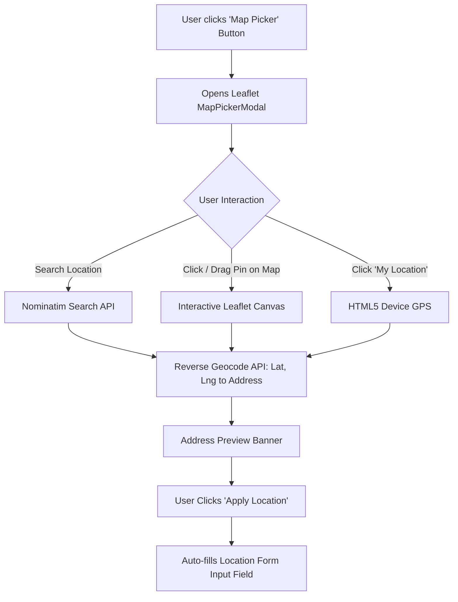

# AgriTrace Location & Interactive Map Picker Documentation

## Overview
The **AgriTrace Location Service** enables users (farmers, inspectors, logistics operators, admins) to accurately record location information during supply chain event logging and event requests.

To provide maximum flexibility and precision, AgriTrace supports two location input modes:
1. **Interactive 3rd-Party Map Picker (Leaflet & OpenStreetMap)**: Opens a visual map modal where users can search for any city/place/warehouse/farm, drag a map pin marker, or click anywhere directly on the interactive map to select exact coordinates and addresses.
2. **Device GPS Location (Computer / Mobile Device Hardware)**: Uses the HTML5 Browser Geolocation API (`navigator.geolocation`) with high-accuracy GPS/Wi-Fi positioning.

---

## 🏗️ Interactive Map Architecture & Component Flow

---

## 🛠️ Map Picker Component (`MapPickerModal.tsx`)

### Features:
- **Interactive OpenStreetMap Tiles**: High-resolution, worldwide mapping powered by Leaflet.js.
- **Detailed Vietnamese Administrative Hierarchy**: Optimized to search and reverse-geocode 4 levels of administrative divisions in Vietnam:
  `[Thôn/Xóm/Ấp/Tổ/Đường], [Xã/Phường/Thị Trấn], [Huyện/Quận/Thị Xã], [Tỉnh/Thành Phố]`
  (e.g., `"Thôn Phú Lý, Xã Đại Lộc, Huyện Hậu Lộc, Tỉnh Thanh Hóa"`).
- **Search Bar**: Built-in location search engine utilizing OpenStreetMap Nominatim (`https://nominatim.openstreetmap.org/search?q=...&addressdetails=1`). Supports detailed Vietnamese administrative queries like `"Đại Lộc, Hậu Lộc, Thanh Hóa"`.
- **Click & Drag Pin**: Clicking on any tile or dragging the map marker dynamically triggers reverse geocoding to resolve `(latitude, longitude)` into human-readable Vietnamese location addresses.
- **Auto Reverse Geocoding Dual Provider**: Primary query to Nominatim with `Accept-Language: vi,en`, with seamless fallback to BigDataCloud Reverse Geocode API.
- **Device GPS Integration**: Includes a `"My Location"` button inside the map controls to instantly center the map on the user's current GPS position.

---

## 📱 Integrated Pages

1. **[EventRequestsPage.tsx](file:///c:/Users/Admin/source/repos/Code_GroupFive/AgriTrace-Frontend/src/features/event-requests/EventRequestsPage.tsx)** (`/app/event-requests`):
   - Includes **`Device (GPS)`** and **`Map Picker`** action buttons right next to the `Location` form label.
2. **[SupplyChainPage.tsx](file:///c:/Users/Admin/source/repos/Code_GroupFive/AgriTrace-Frontend/src/features/supply-chain/SupplyChainPage.tsx)** (`/app/supply-chain`):
   - Enables operators to visually pin locations on the map before submitting supply chain events to the Blockchain/ledger.

---

## 📊 Summary of Tech Stack

| Component | Library / API | Functionality |
| :--- | :--- | :--- |
| **Map Rendering** | `leaflet` / `@types/leaflet` | OpenStreetMap tile layer canvas |
| **Location Search** | OpenStreetMap Nominatim | Forward Geocoding (`search?q=...`) |
| **Address Lookup** | OpenStreetMap Nominatim | Reverse Geocoding (`reverse?lat=...&lon=...`) |
| **Hardware GPS** | HTML5 Geolocation API | High-accuracy device coordinates |
