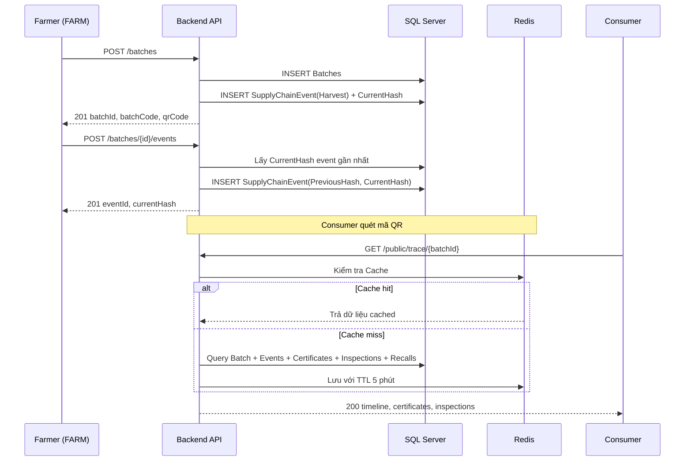

# API Specification — Agricultural Supply Chain Traceability System

**Version:** 2.0
**Base URL:** `https://api.agritrace.vn/api/v1`  
**Public Trace URL:** `https://agritrace.vn/trace/{batchId}`  
**Format:** REST / JSON  
**Encoding:** UTF-8  
**Auth Scheme:** Bearer JWT (Access Token + Refresh Token)

---

## Mục lục

1. [Quy ước chung](#1-quy-ước-chung)
2. [Phân quyền (RBAC)](#2-phân-quyền-rbac)
3. [Xác thực — Auth](#3-xác-thực--auth)
4. [Quản lý Tổ chức — Organizations](#4-quản-lý-tổ-chức--organizations)
5. [Quản lý Người dùng — Users](#5-quản-lý-người-dùng--users)
6. [Quản lý Sản phẩm — Products](#6-quản-lý-sản-phẩm--products)
7. [Quản lý Lô hàng — Batches](#7-quản-lý-lô-hàng--batches)
8. [Chuỗi sự kiện — Supply Chain Events](#8-chuỗi-sự-kiện--supply-chain-events)
9. [Tách lô — Batch Split](#9-tách-lô--batch-split)
10. [Gộp lô — Batch Merge](#10-gộp-lô--batch-merge)
11. [Kiểm định Chất lượng — Quality Inspections](#11-kiểm-định-chất-lượng--quality-inspections)
12. [Chứng nhận — Certificates](#12-chứng-nhận--certificates)
13. [Thu hồi sản phẩm — Recalls](#13-thu-hồi-sản-phẩm--recalls)
14. [Thông báo — Notifications](#14-thông-báo--notifications)
15. [Tra cứu Công khai — Public Traceability](#15-tra-cứu-công-khai--public-traceability)
16. [Dashboard & Analytics](#16-dashboard--analytics)
17. [Lookup / Danh mục hệ thống](#17-lookup--danh-mục-hệ-thống)
18. [Mã lỗi chung](#18-mã-lỗi-chung)

---

## 1. Quy ước chung

### 1.1. Request Headers

| Header | Bắt buộc | Mô tả |
|--------|----------|-------|
| `Content-Type` | Có (với body) | `application/json` |
| `Authorization` | Có (các route bảo vệ) | `Bearer <access_token>` |
| `Accept-Language` | Không | `vi` hoặc `en` |

### 1.2. Response Envelope

Mọi response đều bọc trong envelope chuẩn:

```json
{
  "success": true,
  "data": { ... },
  "message": "string",
  "errors": null,
  "timestamp": "2026-07-06T06:00:00Z"
}
```

**Response lỗi:**

```json
{
  "success": false,
  "data": null,
  "message": "Validation failed",
  "errors": [
    { "field": "email", "code": "REQUIRED", "message": "Email là bắt buộc" }
  ],
  "timestamp": "2026-07-06T06:00:00Z"
}
```

### 1.3. Phân trang (Pagination)

Các endpoint trả về danh sách hỗ trợ query params sau:

| Param | Kiểu | Mặc định | Mô tả |
|-------|------|----------|-------|
| `page` | int | `1` | Trang hiện tại |
| `pageSize` | int | `20` | Số bản ghi/trang (tối đa 100) |
| `sortBy` | string | — | Tên cột sắp xếp |
| `sortDir` | string | `asc` | `asc` hoặc `desc` |

**Response body phân trang:**

```json
{
  "success": true,
  "data": {
    "items": [ ... ],
    "totalCount": 150,
    "page": 1,
    "pageSize": 20,
    "totalPages": 8
  }
}
```

### 1.4. Định dạng thời gian

Toàn bộ datetime sử dụng **ISO 8601 UTC**: `"2026-07-06T06:00:00Z"`

### 1.5. HTTP Status Codes

| Code | Ý nghĩa |
|------|---------|
| `200 OK` | Thành công (GET, PUT, PATCH) |
| `201 Created` | Tạo mới thành công (POST) |
| `204 No Content` | Thành công không trả body (DELETE) |
| `400 Bad Request` | Dữ liệu đầu vào không hợp lệ |
| `401 Unauthorized` | Chưa xác thực hoặc token hết hạn |
| `403 Forbidden` | Không đủ quyền |
| `404 Not Found` | Không tìm thấy resource |
| `409 Conflict` | Xung đột dữ liệu (duplicate, sai trạng thái) |
| `422 Unprocessable Entity` | Vi phạm quy tắc nghiệp vụ |
| `500 Internal Server Error` | Lỗi hệ thống |

---

## 2. Phân quyền (RBAC)

### 2.1. Danh sách Roles

| Role | Mô tả |
|------|-------|
| `ADMIN` | Toàn quyền hệ thống |
| `ORGADMIN` | Quản trị trong phạm vi tổ chức của mình |
| `FARMER` | Quản lý nông trại — tạo lô và ghi nhận thu hoạch |
| `OPERATOR` | Vận hành chuỗi cung ứng — chế biến, vận chuyển, tách/gộp lô |
| `INSPECTOR` | Thực hiện kiểm định, cấp chứng nhận, thu hồi sản phẩm |

> **Consumer** không có tài khoản — chỉ truy cập Public API.

### 2.2. Ma trận phân quyền tổng quan

| Tính năng | ADMIN | ORGADMIN | FARMER | OPERATOR | INSPECTOR |
|-----------|:-----:|:--------:|:------:|:--------:|:---------:|
| Quản lý tổ chức | ✅ | ❌ | ❌ | ❌ | ❌ |
| Quản lý người dùng (toàn hệ thống) | ✅ | ❌ | ❌ | ❌ | ❌ |
| Quản lý người dùng (trong tổ chức) | ✅ | ✅ | ❌ | ❌ | ❌ |
| Quản lý sản phẩm | ✅ | ✅ | ❌ | ❌ | ❌ |
| Tạo Batch | ✅ | ✅ | ✅ | ❌ | ❌ |
| Ghi Supply Chain Event | ✅ | ✅ | ✅ | ✅ | ❌ |
| Split / Merge Batch | ✅ | ✅ | ❌ | ✅ | ❌ |
| Kiểm định chất lượng | ✅ | ❌ | ❌ | ❌ | ✅ |
| Cấp chứng nhận | ✅ | ❌ | ❌ | ❌ | ✅ |
| Kích hoạt Recall | ✅ | ❌ | ❌ | ❌ | ✅ |
| Xem Dashboard | ✅ | ✅ | ✅ | ✅ | ✅ |
| Public Traceability | Public | Public | Public | Public | Public |

### 2.3. Phân quyền Event theo Organization Type

| Organization Type | Sự kiện được phép |
|------------------|--------------------|
| `FARM` | `HARVEST` |
| `PROCESSOR` | `PROCESS`, `PACKAGE`, `TRANSPORT`, `SPLIT`, `MERGE` |
| `DISTRIBUTOR` | `TRANSPORT`, `RECEIVE`, `SPLIT`, `MERGE` |
| `RETAILER` | `RECEIVE` |

> `INSPECT` event được ghi bởi user có role `INSPECTOR` (không phụ thuộc Organization Type).

---

## 3. Xác thực — Auth

### 3.1. Đăng nhập

```
POST /auth/login
```

**Authorization:** Không yêu cầu

**Request Body:**

```json
{
  "email": "user@agritrace.vn",
  "password": "P@ssw0rd123"
}
```

| Field | Kiểu | Bắt buộc | Mô tả |
|-------|------|----------|-------|
| `email` | string | ✅ | Email đăng ký |
| `password` | string | ✅ | Mật khẩu (min 8 ký tự) |

**Response `200 OK`:**

```json
{
  "success": true,
  "data": {
    "accessToken": "eyJhbGciOiJIUzI1NiIsInR5...",
    "accessTokenExpiresAt": "2026-07-06T07:00:00Z",
    "refreshToken": "d7f3a1b2c4e5...",
    "refreshTokenExpiresAt": "2026-07-13T06:00:00Z",
    "user": {
      "userId": 1,
      "fullName": "Nguyễn Văn A",
      "email": "user@agritrace.vn",
      "role": "FARMER",
      "organizationId": 1,
      "organizationName": "Nông trại Sơn La",
      "organizationType": "FARM"
    }
  },
  "message": "Đăng nhập thành công"
}
```

**Lỗi:**

| HTTP | Code | Mô tả |
|------|------|-------|
| `401` | `INVALID_CREDENTIALS` | Email hoặc mật khẩu sai |
| `403` | `ACCOUNT_DEACTIVATED` | Tài khoản bị vô hiệu hóa |

---

### 3.2. Làm mới Access Token

```
POST /auth/refresh-token
```

**Authorization:** Không yêu cầu (dùng refresh token)

**Request Body:**

```json
{
  "refreshToken": "d7f3a1b2c4e5..."
}
```

**Response `200 OK`:**

```json
{
  "success": true,
  "data": {
    "accessToken": "eyJhbGciOiJIUzI1NiIsInR5...",
    "accessTokenExpiresAt": "2026-07-06T08:00:00Z",
    "refreshToken": "new_refresh_token_value...",
    "refreshTokenExpiresAt": "2026-07-13T07:00:00Z"
  }
}
```

> **Cơ chế xoay vòng:** Mỗi lần refresh, `refreshToken` cũ bị revoke và cấp token mới (Token Rotation).

**Lỗi:**

| HTTP | Code | Mô tả |
|------|------|-------|
| `401` | `INVALID_REFRESH_TOKEN` | Token không hợp lệ hoặc đã bị revoke |
| `401` | `REFRESH_TOKEN_EXPIRED` | Token đã hết hạn |

---

### 3.3. Đăng xuất

```
POST /auth/logout
```

**Authorization:** `Bearer <access_token>`

**Request Body:**

```json
{
  "refreshToken": "d7f3a1b2c4e5..."
}
```

**Response `204 No Content`**

---

### 3.4. Thông tin người dùng hiện tại

```
GET /auth/me
```

**Authorization:** `Bearer <access_token>`

**Response `200 OK`:**

```json
{
  "success": true,
  "data": {
    "userId": 1,
    "fullName": "Nguyễn Văn A",
    "email": "user@agritrace.vn",
    "role": "FARMER",
    "isActive": true,
    "organizationId": 1,
    "organizationName": "Nông trại Sơn La",
    "organizationType": "FARM"
  }
}
```

---

### 3.5. Đổi mật khẩu

```
PUT /auth/change-password
```

**Authorization:** `Bearer <access_token>`

**Request Body:**

```json
{
  "currentPassword": "OldP@ss123",
  "newPassword": "NewP@ss456",
  "confirmNewPassword": "NewP@ss456"
}
```

**Response `200 OK`**

**Lỗi:**

| HTTP | Code | Mô tả |
|------|------|-------|
| `400` | `WRONG_CURRENT_PASSWORD` | Mật khẩu hiện tại sai |
| `400` | `PASSWORD_MISMATCH` | `newPassword` ≠ `confirmNewPassword` |

---

## 4. Quản lý Tổ chức — Organizations

### 4.1. Lấy danh sách tổ chức

```
GET /organizations
```

**Authorization:** `Admin`

**Query Params:**

| Param | Kiểu | Mô tả |
|-------|------|-------|
| `type` | string | Lọc theo loại tổ chức (`FARM`, `PROCESSOR`, `DISTRIBUTOR`, `RETAILER`) |
| `status` | string | Lọc theo trạng thái (`ACTIVE`, `INACTIVE`, `SUSPENDED`) |
| `search` | string | Tìm theo tên |
| `page`, `pageSize` | int | Phân trang |

**Response `200 OK`:**

```json
{
  "success": true,
  "data": {
    "items": [
      {
        "organizationId": 1,
        "name": "Nông trại Sơn La",
        "type": "FARM",
        "status": "ACTIVE",
        "createdAt": "2026-01-01T00:00:00Z"
      }
    ],
    "totalCount": 45,
    "page": 1,
    "pageSize": 20,
    "totalPages": 3
  }
}
```

---

### 4.2. Lấy chi tiết tổ chức

```
GET /organizations/{organizationId}
```

**Authorization:** `ADMIN` | `ORGADMIN` (chỉ xem tổ chức mình)

**Response `200 OK`:** Object tổ chức đầy đủ.

---

### 4.3. Tạo tổ chức mới

```
POST /organizations
```

**Authorization:** `ADMIN`

**Request Body:**

```json
{
  "name": "Nông trại Sơn La",
  "type": "FARM"
}
```

| Field | Kiểu | Bắt buộc | Mô tả |
|-------|------|----------|-------|
| `name` | string | ✅ | Tên tổ chức (unique, max 200) |
| `type` | string | ✅ | Loại tổ chức (`FARM`, `PROCESSOR`, `DISTRIBUTOR`, `RETAILER`) |

**Response `201 Created`:**

```json
{
  "success": true,
  "data": {
    "organizationId": 1,
    "name": "Nông trại Sơn La",
    "type": "FARM",
    "status": "ACTIVE",
    "createdAt": "2026-07-06T06:30:00Z"
  }
}
```

---

### 4.4. Cập nhật tổ chức

```
PUT /organizations/{organizationId}
```

**Authorization:** `ADMIN`

**Request Body:**

```json
{
  "name": "Nông trại Sơn La mới",
  "type": "FARM"
}
```

**Response `200 OK`:** Object tổ chức sau cập nhật.

---

### 4.5. Cập nhật trạng thái tổ chức

```
PATCH /organizations/{organizationId}/status
```

**Authorization:** `ADMIN`

**Request Body:**

```json
{
  "status": "INACTIVE"
}
```

| Field | Kiểu | Bắt buộc | Mô tả |
|-------|------|----------|-------|
| `status` | string | ✅ | `ACTIVE`, `INACTIVE`, hoặc `SUSPENDED` |

**Response `200 OK`**

---

## 5. Quản lý Người dùng — Users

### 5.1. Lấy danh sách người dùng

```
GET /users
```

**Authorization:** `ADMIN` (toàn hệ thống) | `ORGADMIN` (trong tổ chức mình)

**Query Params:** `organizationId`, `role`, `isActive`, `search`, `page`, `pageSize`

**Response `200 OK`:**

```json
{
  "success": true,
  "data": {
    "items": [
      {
        "userId": 1,
        "fullName": "Nguyễn Văn A",
        "email": "user@agritrace.vn",
        "role": "FARMER",
        "organizationId": 1,
        "organizationName": "Nông trại Sơn La",
        "isActive": true,
        "createdAt": "2026-01-01T00:00:00Z"
      }
    ],
    "totalCount": 30,
    "page": 1,
    "pageSize": 20,
    "totalPages": 2
  }
}
```

---

### 5.2. Lấy chi tiết người dùng

```
GET /users/{userId}
```

**Authorization:** `ADMIN` | `ORGADMIN` | Chủ tài khoản

---

### 5.3. Tạo người dùng mới

```
POST /users
```

**Authorization:** `ADMIN` | `ORGADMIN`

**Request Body:**

```json
{
  "organizationId": 1,
  "role": "FARMER",
  "fullName": "Trần Thị B",
  "email": "tranb@agritrace.vn",
  "password": "TempP@ss123"
}
```

| Field | Kiểu | Bắt buộc | Mô tả |
|-------|------|----------|-------|
| `organizationId` | int | ❌ | Tổ chức trực thuộc (có thể null cho ADMIN) |
| `role` | string | ✅ | `ADMIN`, `ORGADMIN`, `FARMER`, `OPERATOR`, `INSPECTOR` |
| `fullName` | string | ✅ | Họ tên (max 200) |
| `email` | string | ✅ | Email đăng nhập (unique) |
| `password` | string | ✅ | Mật khẩu khởi tạo (min 8) |

**Response `201 Created`:** Object người dùng vừa tạo.

---

### 5.4. Cập nhật người dùng

```
PUT /users/{userId}
```

**Authorization:** `ADMIN` | `ORGADMIN` | Chủ tài khoản

**Request Body:**

```json
{
  "fullName": "Trần Thị B",
  "role": "OPERATOR"
}
```

**Response `200 OK`:** Object người dùng sau cập nhật.

---

### 5.5. Kích hoạt / Vô hiệu hóa tài khoản

```
PATCH /users/{userId}/status
```

**Authorization:** `ADMIN` | `ORGADMIN`

**Request Body:** `{ "isActive": false }`

**Response `200 OK`**

---

## 6. Quản lý Sản phẩm — Products

### 6.1. Lấy danh sách sản phẩm

```
GET /products
```

**Authorization:** Authenticated

**Query Params:** `organizationId`, `category`, `search`, `page`, `pageSize`

**Response `200 OK`:**

```json
{
  "success": true,
  "data": {
    "items": [
      {
        "productId": 1,
        "organizationId": 1,
        "organizationName": "Nông trại Sơn La",
        "name": "Cà chua bi",
        "category": "Rau củ",
        "unit": "kg"
      }
    ],
    "totalCount": 50,
    "page": 1,
    "pageSize": 20,
    "totalPages": 3
  }
}
```

---

### 6.2. Lấy chi tiết sản phẩm

```
GET /products/{productId}
```

**Authorization:** Authenticated

---

### 6.3. Tạo sản phẩm

```
POST /products
```

**Authorization:** `ADMIN` | `ORGADMIN`

**Request Body:**

```json
{
  "organizationId": 1,
  "name": "Cà chua bi",
  "category": "Rau củ",
  "unit": "kg"
}
```

| Field | Kiểu | Bắt buộc | Mô tả |
|-------|------|----------|-------|
| `organizationId` | int | ✅ | Tổ chức sở hữu sản phẩm |
| `name` | string | ✅ | Tên sản phẩm (unique trong tổ chức, max 200) |
| `category` | string | ❌ | Loại sản phẩm |
| `unit` | string | ❌ | Đơn vị đo mặc định |

**Response `201 Created`**

---

### 6.4. Cập nhật sản phẩm

```
PUT /products/{productId}
```

**Authorization:** `ADMIN` | `ORGADMIN`

**Response `200 OK`**

---

## 7. Quản lý Lô hàng — Batches

### 7.1. Lấy danh sách lô hàng

```
GET /batches
```

**Authorization:** Authenticated

**Query Params:**

| Param | Kiểu | Mô tả |
|-------|------|-------|
| `productId` | int | Lọc theo sản phẩm |
| `organizationId` | int | Lọc theo tổ chức đang giữ |
| `batchCode` | string | Tìm theo mã lô |
| `fromDate` | datetime | Lọc từ ngày tạo |
| `toDate` | datetime | Lọc đến ngày tạo |
| `page`, `pageSize` | int | Phân trang |

**Response `200 OK`:**

```json
{
  "success": true,
  "data": {
    "items": [
      {
        "batchId": 1,
        "batchCode": "BTH-20260701-001",
        "productId": 1,
        "productName": "Cà chua bi",
        "productCategory": "Rau củ",
        "quantity": 500.0,
        "currentOrganizationId": 1,
        "currentOrganizationName": "Nông trại Sơn La",
        "parentBatchId": null,
        "rootBatchId": null,
        "qrCode": "https://agritrace.vn/trace/1",
        "createdAt": "2026-07-01T06:00:00Z"
      }
    ],
    "totalCount": 120,
    "page": 1,
    "pageSize": 20,
    "totalPages": 6
  }
}
```

---

### 7.2. Lấy chi tiết lô hàng

```
GET /batches/{batchId}
```

**Authorization:** Authenticated

**Response `200 OK`:**

```json
{
  "success": true,
  "data": {
    "batchId": 1,
    "batchCode": "BTH-20260701-001",
    "productId": 1,
    "productName": "Cà chua bi",
    "productCategory": "Rau củ",
    "quantity": 500.0,
    "currentOrganizationId": 1,
    "currentOrganizationName": "Nông trại Sơn La",
    "parentBatchId": null,
    "rootBatchId": null,
    "qrCode": "https://agritrace.vn/trace/1",
    "createdAt": "2026-07-01T06:00:00Z",
    "images": [
      {
        "batchImageId": 1,
        "imageUrl": "https://cdn.agritrace.vn/batches/1/img001.jpg",
        "caption": "Ảnh thu hoạch",
        "displayOrder": 1,
        "eventId": null
      }
    ]
  }
}
```

---

### 7.3. Tạo lô hàng mới

```
POST /batches
```

**Authorization:** `ORGADMIN` | `FARMER`

> Việc tạo lô tự động ghi nhận sự kiện `HARVEST` đầu tiên trong chuỗi SupplyChainEvents của lô này.

**Request Body:**

```json
{
  "productId": 1,
  "quantity": 500.0
}
```

| Field | Kiểu | Bắt buộc | Mô tả |
|-------|------|----------|-------|
| `productId` | int | ✅ | Sản phẩm (bất biến sau khi tạo) |
| `quantity` | decimal | ✅ | Số lượng ban đầu (> 0) |

**Response `201 Created`:**

```json
{
  "success": true,
  "data": {
    "batchId": 1,
    "batchCode": "BTH-20260701-001",
    "qrCode": "https://agritrace.vn/trace/1"
  },
  "message": "Lô hàng tạo thành công, mã QR đã được cấp phát"
}
```

---

### 7.4. Tải xuống QR Code

```
GET /batches/{batchId}/qr-code
```

**Authorization:** Authenticated

**Response `200 OK`:** `Content-Type: image/png` — File ảnh PNG mã QR.

---

### 7.5. Upload ảnh lô hàng

```
POST /batches/{batchId}/images
```

**Authorization:** `ORGADMIN` | `FARMER` | `OPERATOR` (trong tổ chức giữ lô)

**Content-Type:** `multipart/form-data`

| Field | Kiểu | Bắt buộc | Mô tả |
|-------|------|----------|-------|
| `file` | file | ✅ | Ảnh (jpg/png, max 5MB) |
| `caption` | string | ❌ | Chú thích |
| `displayOrder` | int | ❌ | Thứ tự hiển thị |
| `eventId` | int | ❌ | Liên kết sự kiện |

**Response `201 Created`:**

```json
{
  "success": true,
  "data": {
    "batchImageId": 1,
    "batchId": 1,
    "imageUrl": "https://cdn.agritrace.vn/batches/1/img001.jpg",
    "caption": "Ảnh thu hoạch",
    "displayOrder": 1,
    "eventId": null,
    "createdAt": "2026-07-01T07:00:00Z"
  }
}
```

---

## 8. Chuỗi sự kiện — Supply Chain Events

> **Nguyên tắc bất biến:** `SupplyChainEvents` là **Append-only**. Không cung cấp API UPDATE hoặc DELETE.

### 8.1. Danh sách Event Types

| Event Type | Mô tả | Org Type được phép |
|------------|-------|-------------------|
| `HARVEST` | Thu hoạch | FARM |
| `PROCESS` | Chế biến | PROCESSOR |
| `PACKAGE` | Đóng gói | PROCESSOR |
| `TRANSPORT` | Vận chuyển | PROCESSOR, DISTRIBUTOR |
| `RECEIVE` | Nhận hàng | DISTRIBUTOR, RETAILER |
| `INSPECT` | Kiểm định | INSPECTOR (role) |
| `SPLIT` | Tách lô | PROCESSOR, DISTRIBUTOR |
| `MERGE` | Gộp lô | PROCESSOR, DISTRIBUTOR |

> **Lưu ý:** `INSPECT` event được ghi bởi user có role `INSPECTOR`, không phụ thuộc vào Organization Type.

### 8.2. Lấy lịch sử sự kiện

```
GET /batches/{batchId}/events
```

**Authorization:** Authenticated

**Query Params:** `page`, `pageSize`

**Response `200 OK`:**

```json
{
  "success": true,
  "data": {
    "items": [
      {
        "eventId": 1,
        "batchId": 1,
        "eventType": "HARVEST",
        "organizationId": 1,
        "organizationName": "Nông trại Sơn La",
        "userId": 1,
        "userName": "Nguyễn Văn A",
        "location": "Xã Mường Bon, Sơn La",
        "eventData": null,
        "previousHash": null,
        "currentHash": "a3f1b2c4d5e6f7a8b9c0d1e2f3a4b5c6d7e8f9a0b1c2d3e4f5a6b7c8d9e0f1a2",
        "createdAt": "2026-07-01T06:05:00Z"
      }
    ],
    "totalCount": 5,
    "hashChainValid": true
  }
}
```

---

### 8.3. Ghi nhận sự kiện mới

```
POST /batches/{batchId}/events
```

**Authorization:** `ORGADMIN` | `FARMER` | `OPERATOR`

**Request Body:**

```json
{
  "eventType": "PROCESS",
  "organizationId": 2,
  "location": "Khu chế biến A - TP. Sơn La",
  "eventData": "{\"temperature\": 25, \"humidity\": 70}",
  "eventTime": "2026-07-02T08:00:00Z"
}
```

| Field | Kiểu | Bắt buộc | Mô tả |
|-------|------|----------|-------|
| `eventType` | string | ✅ | Loại sự kiện (xem danh sách 8.1) |
| `organizationId` | int | ✅ | Tổ chức thực hiện sự kiện |
| `location` | string | ❌ | Địa điểm |
| `eventData` | string (JSON) | ❌ | Dữ liệu chi tiết sự kiện (JSON string) |
| `eventTime` | datetime | ❌ | Thời điểm thực tế (lưu trong eventData nếu có) |

> `organizationId` mặc định lấy từ tổ chức của user đang xác thực nếu không truyền.

**Response `201 Created`:**

```json
{
  "success": true,
  "data": {
    "eventId": 2,
    "batchId": 1,
    "eventType": "PROCESS",
    "previousHash": "a3f1b2c4d5e6f7a8b9c0d1e2f3a4b5c6d7e8f9a0b1c2d3e4f5a6b7c8d9e0f1a2",
    "currentHash": "b4a2c1d3e5f6a7b8c9d0e1f2a3b4c5d6e7f8a9b0c1d2e3f4a5b6c7d8e9f0a1b2",
    "createdAt": "2026-07-02T08:01:00Z"
  },
  "message": "Sự kiện đã được ghi nhận thành công"
}
```

---

### 8.4. Kiểm tra tính toàn vẹn Hash Chain

```
GET /batches/{batchId}/events/verify-integrity
```

**Authorization:** `ADMIN` | `INSPECTOR`

**Response `200 OK`:**

```json
{
  "success": true,
  "data": {
    "isValid": true,
    "totalEvents": 5
  }
}
```

---

## 9. Tách lô — Batch Split

```
POST /batches/{batchId}/split
```

**Authorization:** `ORGADMIN` | `OPERATOR`

**Ràng buộc nghiệp vụ:**
- Lô cha phải tồn tại và chưa bị thu hồi.
- `SUM(childBatches[].quantity)` <= `quantity` lô cha.
- Mỗi lô con có cùng `ProductId`.

**Request Body:**

```json
{
  "childBatches": [
    { "quantity": 100.0 },
    { "quantity": 150.0 }
  ],
  "location": "Kho Sơn La",
  "eventTime": "2026-07-03T07:00:00Z"
}
```

| Field | Kiểu | Bắt buộc | Mô tả |
|-------|------|----------|-------|
| `childBatches` | array | ✅ | Danh sách lô con |
| `childBatches[].quantity` | decimal | ✅ | Số lượng lô con (> 0) |
| `location` | string | ❌ | Địa điểm tách lô |
| `eventTime` | datetime | ❌ | Thời điểm thực tế |

**Response `201 Created`:**

```json
{
  "success": true,
  "data": {
    "parentBatchId": 1,
    "splitEventId": 3,
    "childBatches": [
      { "batchId": 2, "batchCode": "BTH-20260703-002", "quantity": 100.0, "qrCode": "https://agritrace.vn/trace/2" },
      { "batchId": 3, "batchCode": "BTH-20260703-003", "quantity": 150.0, "qrCode": "https://agritrace.vn/trace/3" }
    ]
  }
}
```

> Quan hệ tách lô được ghi trong bảng `BatchRelations` với `RelationType = 'SPLIT'`.

---

## 10. Gộp lô — Batch Merge

```
POST /batches/merge
```

**Authorization:** `ORGADMIN` | `OPERATOR`

**Request Body:**

```json
{
  "sources": [
    { "batchId": 2, "quantity": 80.0 },
    { "batchId": 3, "quantity": 120.0 }
  ],
  "location": "Kho phân phối Hà Nội",
  "description": "Gộp 2 lô nhỏ thành lô lớn",
  "eventTime": "2026-07-04T07:00:00Z"
}
```

| Field | Kiểu | Bắt buộc | Mô tả |
|-------|------|----------|-------|
| `sources` | array | ✅ | Danh sách lô nguồn |
| `sources[].batchId` | int | ✅ | ID lô nguồn |
| `sources[].quantity` | decimal | ✅ | Số lượng lấy từ lô nguồn |
| `location` | string | ❌ | Địa điểm gộp lô |
| `description` | string | ❌ | Ghi chú |
| `eventTime` | datetime | ❌ | Thời điểm thực tế |

**Ràng buộc nghiệp vụ:**
- Các lô nguồn phải cùng `ProductId`.
- `quantity` mỗi lô nguồn không vượt quá `quantity` của lô đó.

**Response `201 Created`:**

```json
{
  "success": true,
  "data": {
    "resultBatch": {
      "batchId": 4,
      "batchCode": "BTH-20260704-004",
      "totalQuantity": 200.0,
      "qrCode": "https://agritrace.vn/trace/4"
    },
    "mergeEventId": 4,
    "sourceBatches": [2, 3]
  }
}
```

> Quan hệ gộp lô được ghi trong bảng `BatchRelations` với `RelationType = 'MERGE'`.

---

## 11. Kiểm định Chất lượng — Quality Inspections

### 11.1. Lấy danh sách kiểm định

```
GET /batches/{batchId}/inspections
```

**Authorization:** `ADMIN` | `ORGADMIN` | `INSPECTOR`

**Response `200 OK`:**

```json
{
  "success": true,
  "data": {
    "items": [
      {
        "inspectionId": 1,
        "batchId": 1,
        "inspectorId": 3,
        "inspectorName": "Trần Văn C",
        "result": "PASS",
        "notes": "Mẫu đạt tiêu chuẩn VietGAP",
        "createdAt": "2026-07-02T10:00:00Z"
      }
    ]
  }
}
```

---

### 11.2. Tạo kiểm định mới

```
POST /batches/{batchId}/inspections
```

**Authorization:** `INSPECTOR`

**Request Body:**

```json
{
  "result": "PASS",
  "notes": "Mẫu đạt tiêu chuẩn VietGAP, độ ẩm 12.5%"
}
```

| Field | Kiểu | Bắt buộc | Mô tả |
|-------|------|----------|-------|
| `result` | string | ✅ | `PASS`, `FAIL`, `PENDING` |
| `notes` | string | ❌ | Ghi chú chi tiết |

> Việc tạo inspection tự động ghi sự kiện `INSPECT` trong SupplyChainEvents.

**Response `201 Created`**

---

### 11.3. Lấy chi tiết kiểm định

```
GET /inspections/{inspectionId}
```

**Authorization:** `ADMIN` | `INSPECTOR` | `ORGADMIN`

---

## 12. Chứng nhận — Certificates

### 12.1. Lấy danh sách chứng nhận

```
GET /batches/{batchId}/certificates
```

**Authorization:** `ADMIN` | `ORGADMIN` | `INSPECTOR`

**Response `200 OK`:**

```json
{
  "success": true,
  "data": {
    "items": [
      {
        "certificateId": 1,
        "batchId": 1,
        "inspectionId": 1,
        "certificateType": "VietGAP",
        "fileUrl": "https://cdn.agritrace.vn/certs/vietgap001.pdf",
        "issuedAt": "2026-06-01T00:00:00Z"
      }
    ]
  }
}
```

---

### 12.2. Tạo chứng nhận mới

```
POST /batches/{batchId}/certificates
```

**Authorization:** `INSPECTOR`

**Request Body:**

```json
{
  "inspectionId": 1,
  "certificateType": "VietGAP",
  "fileUrl": "https://cdn.agritrace.vn/certs/vietgap001.pdf"
}
```

| Field | Kiểu | Bắt buộc | Mô tả |
|-------|------|----------|-------|
| `inspectionId` | int | ❌ | ID kiểm định liên quan (nếu có) |
| `certificateType` | string | ✅ | Loại chứng nhận (VietGAP, GlobalGAP, Organic, ISO...) |
| `fileUrl` | string | ✅ | URL file chứng nhận |

**Response `201 Created`**

---

## 13. Thu hồi sản phẩm — Recalls

### 13.1. Lấy danh sách thu hồi

```
GET /recalls
```

**Authorization:** `ADMIN` | `INSPECTOR`

**Response `200 OK`:**

```json
{
  "success": true,
  "data": {
    "items": [
      {
        "recallId": 1,
        "batchId": 1,
        "reason": "Phát hiện dư lượng hóa chất vượt ngưỡng",
        "severity": "CRITICAL",
        "createdBy": 3,
        "createdByName": "Trần Văn C",
        "createdAt": "2026-07-05T10:00:00Z"
      }
    ]
  }
}
```

---

### 13.2. Kích hoạt Thu hồi

```
POST /recalls
```

**Authorization:** `ADMIN` | `INSPECTOR`

**Request Body:**

```json
{
  "batchId": 1,
  "reason": "Phát hiện dư lượng hóa chất vượt ngưỡng",
  "severity": "CRITICAL"
}
```

| Field | Kiểu | Bắt buộc | Mô tả |
|-------|------|----------|-------|
| `batchId` | int | ✅ | ID lô hàng bị thu hồi |
| `reason` | string | ✅ | Lý do thu hồi |
| `severity` | string | ✅ | `LOW`, `MEDIUM`, `HIGH`, `CRITICAL` |

**Response `201 Created`**

---

### 13.3. Giải quyết Thu hồi

```
PATCH /recalls/{recallId}/resolve
```

**Authorization:** `ADMIN` | `INSPECTOR`

---

## 14. Thông báo — Notifications

### 14.1. Lấy danh sách thông báo

```
GET /notifications
```

**Authorization:** Authenticated

**Response `200 OK`:**

```json
{
  "success": true,
  "data": {
    "items": [
      {
        "notificationId": 1,
        "title": "Thu hồi sản phẩm",
        "message": "Lô hàng BTH-20260701-001 đã bị thu hồi",
        "isRead": false,
        "createdAt": "2026-07-05T10:01:00Z"
      }
    ]
  }
}
```

---

### 14.2. Đánh dấu đã đọc

```
PATCH /notifications/{notificationId}/read
```

**Authorization:** Authenticated

**Response `200 OK`**

---

### 14.3. Đánh dấu tất cả đã đọc

```
PATCH /notifications/read-all
```

**Authorization:** Authenticated

**Response `200 OK`**

---

### 14.4. Số thông báo chưa đọc

```
GET /notifications/unread-count
```

**Authorization:** Authenticated

**Response `200 OK`:**

```json
{
  "success": true,
  "data": {
    "unreadCount": 5
  }
}
```

---

## 15. Tra cứu Công khai — Public Traceability

> **Không yêu cầu xác thực.** Tối ưu mobile. Redis Cache TTL 5 phút.

### 15.1. Tra cứu lô hàng theo BatchId / QR

```
GET /public/trace/{batchId}
```

**Authorization:** Không yêu cầu

**Response `200 OK`:** Trả về toàn bộ timeline sự kiện, chứng nhận, kiểm định, phả hệ của lô hàng nông sản.

```json
{
  "success": true,
  "data": {
    "batch": {
      "batchId": 1,
      "batchCode": "BTH-20260701-001",
      "productName": "Cà chua bi",
      "productCategory": "Rau củ",
      "quantity": 500.0,
      "currentOrganizationName": "Nông trại Sơn La",
      "qrCode": "https://agritrace.vn/trace/1",
      "createdAt": "2026-07-01T06:00:00Z"
    },
    "events": [
      {
        "eventType": "HARVEST",
        "organizationName": "Nông trại Sơn La",
        "location": "Xã Mường Bon, Sơn La",
        "eventData": null,
        "createdAt": "2026-07-01T06:05:00Z"
      }
    ],
    "inspections": [],
    "certificates": [],
    "recalls": []
  }
}
```

---

### 15.2. Lấy phả hệ lô hàng (Lineage)

```
GET /public/trace/{batchId}/lineage
```

**Authorization:** Không yêu cầu

**Response `200 OK`:**

```json
{
  "success": true,
  "data": {
    "nodes": [
      { "batchId": 1, "batchCode": "BTH-20260701-001", "quantity": 500.0 },
      { "batchId": 2, "batchCode": "BTH-20260703-002", "quantity": 100.0 },
      { "batchId": 3, "batchCode": "BTH-20260703-003", "quantity": 150.0 }
    ],
    "edges": [
      { "sourceBatchId": 1, "targetBatchId": 2, "relationType": "SPLIT" },
      { "sourceBatchId": 1, "targetBatchId": 3, "relationType": "SPLIT" }
    ]
  }
}
```

---

## 16. Dashboard & Analytics

### 16.1. Tổng quan hệ thống

```
GET /analytics/overview
```

**Authorization:** `ADMIN`

---

### 16.2. Phân bổ lô hàng theo tổ chức

```
GET /analytics/batch-distribution
```

**Authorization:** `ADMIN` | `ORGADMIN`

---

### 16.3. Thời gian xử lý trung bình

```
GET /analytics/processing-time
```

**Authorization:** `ADMIN` | `ORGADMIN`

---

### 16.4. Truy vết ngược (Traceback Analysis)

```
GET /analytics/traceback/{batchId}
```

**Authorization:** `ADMIN` | `INSPECTOR`

---

## 17. Lookup / Danh mục hệ thống

Phân quyền: **Authenticated**

| Endpoint | Mô tả |
|----------|-------|
| `GET /roles` | Danh sách vai trò (`ADMIN`, `ORGADMIN`, `FARMER`, `OPERATOR`, `INSPECTOR`) |
| `GET /organization-types` | Danh sách loại tổ chức (`FARM`, `PROCESSOR`, `DISTRIBUTOR`, `RETAILER`) |
| `GET /event-types` | Danh sách loại sự kiện (`HARVEST`, `PROCESS`, `PACKAGE`, `TRANSPORT`, `RECEIVE`, `INSPECT`, `SPLIT`, `MERGE`) |

> Các danh mục này được định nghĩa tĩnh trong ứng dụng (enum/hằng số), không có bảng lookup riêng trong CSDL.

---

## 18. Mã lỗi chung

| Error Code | HTTP | Mô tả |
|-----------|------|-------|
| `VALIDATION_ERROR` | 400 | Dữ liệu đầu vào không hợp lệ |
| `REQUIRED_FIELD` | 400 | Thiếu trường bắt buộc |
| `INVALID_FORMAT` | 400 | Định dạng dữ liệu sai |
| `WRONG_CURRENT_PASSWORD` | 400 | Mật khẩu hiện tại sai |
| `PASSWORD_MISMATCH` | 400 | Mật khẩu xác nhận không khớp |
| `UNAUTHORIZED` | 401 | Chưa xác thực |
| `TOKEN_EXPIRED` | 401 | Access Token hết hạn |
| `INVALID_REFRESH_TOKEN` | 401 | Refresh Token không hợp lệ |
| `REFRESH_TOKEN_EXPIRED` | 401 | Refresh Token hết hạn |
| `FORBIDDEN` | 403 | Không đủ quyền thực hiện |
| `ACCOUNT_DEACTIVATED` | 403 | Tài khoản bị vô hiệu hóa |
| `EVENT_TYPE_NOT_ALLOWED` | 403 | Loại tổ chức không được phép thực hiện event |
| `SPLIT_NOT_ALLOWED` | 403 | Organization Type không được tách lô |
| `NOT_FOUND` | 404 | Không tìm thấy tài nguyên |
| `BATCH_NOT_FOUND` | 404 | Lô hàng không tồn tại |
| `DUPLICATE_EMAIL` | 409 | Email đã tồn tại |
| `DUPLICATE_NAME` | 409 | Tên đã tồn tại |
| `BATCH_RECALLED` | 409 | Lô hàng đang bị thu hồi |
| `QUANTITY_EXCEEDS_REMAINING` | 422 | Số lượng vượt quá lượng còn lại |
| `PRODUCT_ID_MISMATCH` | 422 | Sản phẩm không đồng nhất giữa các lô nguồn |
| `MERGE_SOURCE_CONFLICT` | 422 | Lô nguồn không hợp lệ hoặc đã bị thu hồi |
| `HASH_CHAIN_BROKEN` | 422 | Chuỗi hash bị gãy — toàn vẹn dữ liệu vi phạm |
| `INTERNAL_ERROR` | 500 | Lỗi hệ thống nội bộ |

---

## Phụ lục A — Sơ đồ luồng API



---

## Phụ lục B — JWT Token Structure

**Access Token Payload (Claims):**

```json
{
  "sub": "1",
  "email": "user@agritrace.vn",
  "role": "FARMER",
  "organizationId": 1,
  "organizationType": "FARM",
  "jti": "unique-jwt-id",
  "iat": 1751688000,
  "exp": 1751691600
}
```

| Claim | Mô tả |
|-------|-------|
| `sub` | UserId (int) |
| `email` | Email người dùng |
| `role` | Tên Role (dùng RBAC) |
| `organizationId` | ID tổ chức |
| `organizationType` | Loại tổ chức (dùng kiểm tra quyền Event) |
| `jti` | JWT ID — liên kết với RefreshToken |
| `iat` | Thời điểm cấp phát (Unix timestamp) |
| `exp` | Thời điểm hết hạn (mặc định: 1 giờ) |

**Refresh Token:** Lưu trong bảng RefreshTokens, thời hạn 7 ngày, hỗ trợ **Token Rotation**.

---

## Phụ lục C — Tổng hợp Endpoint

| # | Method | Endpoint | Auth | Mô tả |
|---|--------|----------|------|-------|
| 1 | POST | `/auth/login` | Public | Đăng nhập |
| 2 | POST | `/auth/refresh-token` | Public | Làm mới token |
| 3 | POST | `/auth/logout` | Bearer | Đăng xuất |
| 4 | GET | `/auth/me` | Bearer | Thông tin bản thân |
| 5 | PUT | `/auth/change-password` | Bearer | Đổi mật khẩu |
| 6 | GET | `/organizations` | ADMIN | Danh sách tổ chức |
| 7 | GET | `/organizations/{id}` | ADMIN/ORGADMIN | Chi tiết tổ chức |
| 8 | POST | `/organizations` | ADMIN | Tạo tổ chức |
| 9 | PUT | `/organizations/{id}` | ADMIN | Cập nhật tổ chức |
| 10 | PATCH | `/organizations/{id}/status` | ADMIN | Đổi trạng thái tổ chức |
| 11 | GET | `/users` | ADMIN/ORGADMIN | Danh sách người dùng |
| 12 | GET | `/users/{id}` | ADMIN/ORGADMIN/Self | Chi tiết người dùng |
| 13 | POST | `/users` | ADMIN/ORGADMIN | Tạo người dùng |
| 14 | PUT | `/users/{id}` | ADMIN/ORGADMIN/Self | Cập nhật người dùng |
| 15 | PATCH | `/users/{id}/status` | ADMIN/ORGADMIN | Đổi trạng thái tài khoản |
| 16 | GET | `/products` | Authenticated | Danh sách sản phẩm |
| 17 | GET | `/products/{id}` | Authenticated | Chi tiết sản phẩm |
| 18 | POST | `/products` | ADMIN/ORGADMIN | Tạo sản phẩm |
| 19 | PUT | `/products/{id}` | ADMIN/ORGADMIN | Cập nhật sản phẩm |
| 20 | GET | `/batches` | Authenticated | Danh sách lô hàng |
| 21 | GET | `/batches/{id}` | Authenticated | Chi tiết lô hàng |
| 22 | POST | `/batches` | ORGADMIN/FARMER | Tạo lô hàng |
| 23 | GET | `/batches/{id}/qr-code` | Authenticated | Tải QR Code |
| 24 | POST | `/batches/{id}/images` | ORGADMIN/FARMER/OPERATOR | Upload ảnh lô hàng |
| 25 | GET | `/batches/{id}/events` | Authenticated | Lịch sử sự kiện |
| 26 | POST | `/batches/{id}/events` | ORGADMIN/FARMER/OPERATOR | Ghi sự kiện mới |
| 27 | GET | `/batches/{id}/events/verify-integrity` | ADMIN/INSPECTOR | Xác minh Hash Chain |
| 28 | POST | `/batches/{id}/split` | ORGADMIN/OPERATOR | Tách lô |
| 29 | POST | `/batches/merge` | ORGADMIN/OPERATOR | Gộp lô |
| 30 | GET | `/batches/{id}/inspections` | ADMIN/ORGADMIN/INSPECTOR | Danh sách kiểm định |
| 31 | POST | `/batches/{id}/inspections` | INSPECTOR | Tạo kiểm định |
| 32 | GET | `/inspections/{id}` | ADMIN/INSPECTOR/ORGADMIN | Chi tiết kiểm định |
| 33 | GET | `/batches/{id}/certificates` | ADMIN/ORGADMIN/INSPECTOR | Danh sách chứng nhận |
| 34 | POST | `/batches/{id}/certificates` | INSPECTOR | Tạo chứng nhận |
| 35 | GET | `/recalls` | ADMIN/INSPECTOR | Danh sách thu hồi |
| 36 | POST | `/recalls` | ADMIN/INSPECTOR | Kích hoạt thu hồi |
| 37 | PATCH | `/recalls/{id}/resolve` | ADMIN/INSPECTOR | Giải quyết thu hồi |
| 38 | GET | `/notifications` | Bearer | Danh sách thông báo |
| 39 | PATCH | `/notifications/{id}/read` | Bearer | Đánh dấu đọc |
| 40 | PATCH | `/notifications/read-all` | Bearer | Đánh dấu tất cả đọc |
| 41 | GET | `/notifications/unread-count` | Bearer | Số thông báo chưa đọc |
| 42 | GET | `/public/trace/{batchId}` | **Public** | Tra cứu công khai |
| 43 | GET | `/public/trace/{batchId}/lineage` | **Public** | Phả hệ lô hàng |
| 44 | GET | `/analytics/overview` | ADMIN | Tổng quan hệ thống |
| 45 | GET | `/analytics/batch-distribution` | ADMIN/ORGADMIN | Phân bổ lô hàng |
| 46 | GET | `/analytics/processing-time` | ADMIN/ORGADMIN | Thời gian xử lý |
| 47 | GET | `/analytics/traceback/{batchId}` | ADMIN/INSPECTOR | Truy vết ngược |
| 48 | GET | `/roles` | Authenticated | Lookup: Roles |
| 49 | GET | `/organization-types` | Authenticated | Lookup: Org Types |
| 50 | GET | `/event-types` | Authenticated | Lookup: Event Types |

---

*Tài liệu dựa trên: Business_Process.md · Database.md · Database_va_Nghiep_vu.md*  
*Phiên bản: 2.0 — Cập nhật: 2026-07-06*
