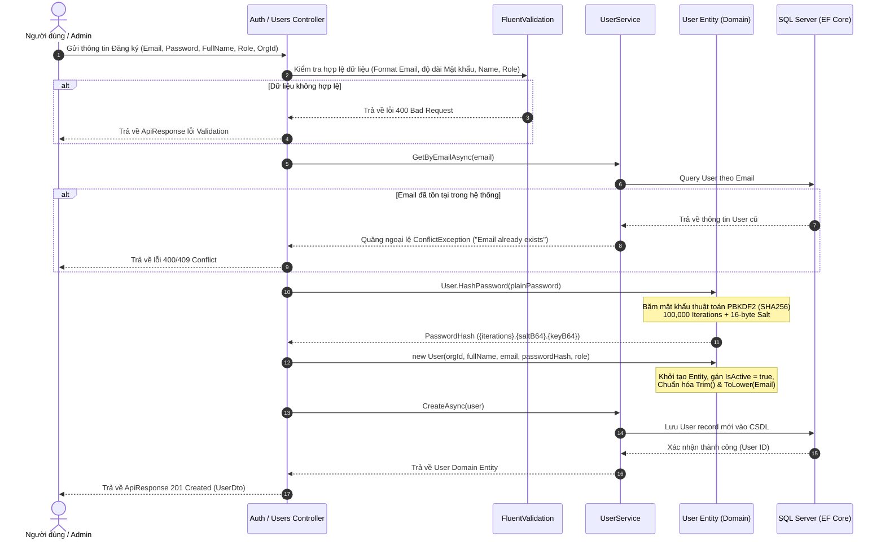

# Tài Liệu Phân Tích Nghiệp Vụ Chức Năng Đăng Ký Người Dùng (Register & User Provisioning) — AgriTrace

> **Dự án:** AgriTrace — Hệ thống Truy xuất Nguồn gốc Nông sản  
> **Tài liệu:** Phân tích Nghiệp vụ (Business Analysis Document)  
> **Ngày cập nhật:** 28/07/2026  

---

## 1. Tổng Quan Nghiệp Vụ (Overview)

Chức năng **Đăng ký / Khởi tạo người dùng** (User Registration & Provisioning) đóng vai trò then chốt trong việc xác thực danh tính và phân định ranh giới trách nhiệm của từng cá nhân/tổ chức tham gia vào chuỗi cung ứng nông sản AgriTrace.

Trong hệ thống AgriTrace, thông tin người dùng không tồn tại độc lập mà gắn liền với:
1. **Tổ chức (Organization)**: Thuộc một trong các loại tổ chức nghiệp vụ như Trang trại (`FARM`), Nhà chế biến (`PROCESSOR`), Nhà phân phối (`DISTRIBUTOR`), Nhà bán lẻ (`RETAILER`), hoặc Đơn vị kiểm định (`INSPECTION`).
2. **Vai trò & Quyền hạn (RBAC)**: Quyết định người dùng được phép thực hiện những loại sự kiện nông sản nào trên chuỗi cung ứng (như `HARVEST`, `PROCESSING`, `TRANSPORT`, `INSPECTION`, v.v.).

---

## 2. Mô Hình Vai Trò & Cấu Trúc Tổ Chức (Role & Organization Alignment)

### 2.1. Phân Loại Vai Trò (User Roles)

Hệ thống phân định 3 cấp độ vai trò chính (Canonical Roles):

| Vai trò Canonical | Vai trò Backend | Phạm vi & Trách nhiệm Nghiệp vụ |
| :--- | :--- | :--- |
| **`ADMIN`** | `Admin` | Quản trị viên tối cao (thuộc tổ chức `SYSTEM`). Có quyền quản lý toàn bộ hệ thống, tạo tổ chức, duyệt danh mục, xử lý sự cố thu hồi khẩn cấp (`RECALL`). |
| **`MANAGER`** | `Manager` | Chủ trang trại / Quản lý tổ chức. Có quyền quản lý nhân sự thuộc tổ chức mình, tạo sản phẩm, lô hàng (`Batch`), xem báo cáo và mời nhân viên. |
| **`STAFF`** | `Staff`, `Farmer`, `Processor`, `Distributor`, `Retailer`, `Inspector`, `Consumer` | Nhân viên vận hành thuộc tổ chức. Thực hiện các thao tác ghi nhận sự kiện nhật ký nông sản (Thu hoạch, Chế biến, Đóng gói, Vận chuyển, Kiểm định...) tùy theo loại tổ chức. |

### 2.2. Phân Loại Tổ Chức Nghiệp Vụ (Organization Types)

1. **`FARM`** (Trang trại / Cơ sở trồng trọt): Quản lý lô nông sản thô, ghi nhận thu hoạch (`HARVEST`).
2. **`PROCESSOR`** (Nhà chế biến / Đóng gói): Ghi nhận nhận hàng (`RECEIVE`), chế biến (`PROCESSING`), đóng gói (`PACKAGING`), tách/gộp lô (`SPLIT`/`MERGE`).
3. **`DISTRIBUTOR`** (Nhà phân phối / Vận chuyển): Ghi nhận vận chuyển (`TRANSPORT`), phân phối (`DISTRIBUTION`).
4. **`RETAILER`** (Nhà bán lẻ / Siêu thị): Ghi nhận bán lẻ (`RETAIL`), tách lô (`SPLIT`).
5. **`INSPECTION`** (Đơn vị kiểm định): Thực hiện kiểm định chất lượng (`INSPECTION`), cấp chứng nhận.
6. **`SYSTEM`** (Hệ thống): Quản trị hệ thống (Chỉ dành riêng cho `ADMIN`).

---

## 3. Các Luồng Nghiệp Vụ Đăng Ký (Business Registration Flows)

Hệ thống hỗ trợ **3 luồng đăng ký / khởi tạo tài khoản** phù hợp với thực tế vận hành chuỗi cung ứng:

### 3.1. Luồng 1: Admin / Manager Khởi Tạo Người Dùng (Admin & Manager Provisioning Flow)
* **Đối tượng thực hiện**: Quản trị viên hệ thống (`ADMIN`) hoặc Quản lý tổ chức (`MANAGER`).
* **Mô tả**: `ADMIN` có thể tạo bất kỳ người dùng nào cho bất kỳ tổ chức nào. `MANAGER` có thể tạo/thêm tài khoản `STAFF` thuộc tổ chức của mình.
* **Endpoint API**: `POST /api/v1/users`
* **Dữ liệu đầu vào**:
  * `FullName` (Họ và tên)
  * `Email` (Địa chỉ Email duy nhất)
  * `Password` (Mật khẩu ban đầu)
  * `Role` (Vai trò: Admin, Manager, Staff, Farmer, ...)
  * `OrganizationId` (Mã định danh tổ chức)

### 3.2. Luồng 2: Đăng Ký Khởi Tạo Tổ Chức (Organization Self-Registration / Onboarding)
* **Đối tượng thực hiện**: Đại diện Doanh nghiệp / Trang trại / Đơn vị mới gia nhập hệ thống.
* **Mô tả**: Người đại diện đăng ký thông tin Tổ chức mới (Tên tổ chức, Loại tổ chức `OrganizationTypeId`, Địa chỉ) đồng thời tạo tài khoản người dùng ban đầu.
* **Kết quả**: Tài khoản đăng ký khởi tạo tổ chức sẽ **tự động nhận vai trò `MANAGER`** của tổ chức đó.

### 3.3. Luồng 3: Mời Nhân Viên Qua Email (Staff Invitation Flow)
* **Đối tượng thực hiện**: Quản lý tổ chức (`MANAGER`).
* **Mô tả**:
  1. `MANAGER` nhập Email của nhân viên mới cần thêm vào tổ chức.
  2. Hệ thống gửi Email chứa Token xác minh gia nhập.
  3. Nhân viên nhấp vào liên kết, nhập Họ tên & Mật khẩu để hoàn tất đăng ký tài khoản `STAFF` gắn liền với `OrganizationId` của Manager.

---

## 4. Sơ Đồ Luồng Xử Lý Chi Tiết (Sequence & Processing Flow)

---

## 5. Quy Tắc Nghiệp Vụ & Ràng Buộc Bảo Mật (Business Rules & Security)

### 5.1. Quy Tắc Kiểm Soát Dữ Liệu (Validation Rules)
1. **Email**:
   - Bắt buộc điền, phải đúng định dạng Email (`@`).
   - Phải là **duy nhất** trên toàn hệ thống (không phân biệt chữ hoa/chữ thường).
   - Tự động chuẩn hóa về dạng viết thường (`email.Trim().ToLowerInvariant()`).
2. **Mật khẩu (Password)**:
   - Độ dài tối thiểu **6 ký tự**.
   - Phải được mã hóa an toàn bằng thuật toán **PBKDF2 SHA256** với 100,000 vòng lặp (Iterations) và Muối ngẫu nhiên (Salt 16-byte). Ký tự lưu trữ dạng chuỗi mã hóa: `{Iterations}.{SaltB64}.{KeyB64}`.
3. **Họ và tên (FullName)**:
   - Bắt buộc điền, độ dài tối đa 200 ký tự. Tự động loại bỏ khoảng trắng thừa (`Trim()`).
4. **Vai trò (Role)**:
   - Phải thuộc danh sách Enum hợp lệ (`Admin`, `Manager`, `Farmer`, `Staff`, `Inspector`, `Consumer`).

### 5.2. Quy Tắc Bảo Mật Phân Quyền (Security & Access Constraints)
* **Cấm Tự Đăng Ký Role `ADMIN`**: Không một API công khai nào cho phép người dùng tự đăng ký vai trò `ADMIN` hoặc tổ chức loại `SYSTEM`. Tài khoản `ADMIN` chỉ do quản trị hệ thống cấp.
* **Trạng Thái Tài Khoản (`IsActive`)**: Khi đăng ký mới thành công, tài khoản mặc định ở trạng thái kích hoạt (`IsActive = true`). Admin hoặc Manager có quyền vô hiệu hóa tài khoản (`Deactivate()`) khi cần ngưng quyền truy cập.
* **Xác Thực JWT Session**: Sau khi đăng ký thành công, người dùng tiến hành Đăng nhập (`/api/v1/auth/login`) để nhận cặp Token:
  - `AccessToken` (Hạn ngắn): Đã nhúng `UserId`, `Email`, `Role`, `OrganizationId`.
  - `RefreshToken` (Hạn dài): Lưu vết trong CSDL để làm mới session mà không cần đăng nhập lại.

---

## 6. Tổng Kết & Khuyến Nghị Phát Triển (Summary & Recommendations)

1. **Khả năng mở rộng**: Mô hình Đăng ký / Tạo người dùng của AgriTrace được thiết kế bám sát kiến trúc Clean Architecture & CQRS (MediatR + FluentValidation), giúp dễ dàng tích hợp thêm các phương thức đăng ký mới (như OTP SMS, OAuth2 Google/Zalo, hoặc SSO Doanh nghiệp).
2. **Khuyến nghị bổ sung**:
   - Tích hợp thêm tính năng **Xác thực Email (Email Verification)** trước khi kích hoạt chính thức tài khoản `IsActive = true`.
   - Bổ sung quy trình **Khôi phục / Đặt lại Mật khẩu qua Email (ForgotPassword / ResetPassword)** đã được định sẵn API stub trong `AuthController`.

---
*Tài liệu được khởi tạo tự động dựa trên phân tích mã nguồn Backend (`AgriTrace-Backend-Group5`) & Frontend (`AgriTrace-Frontend`).*
